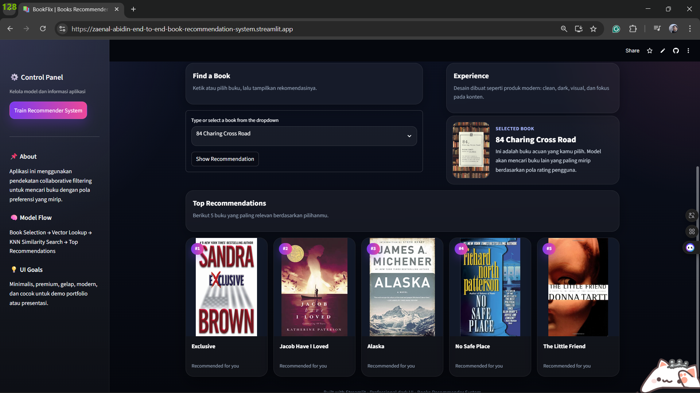
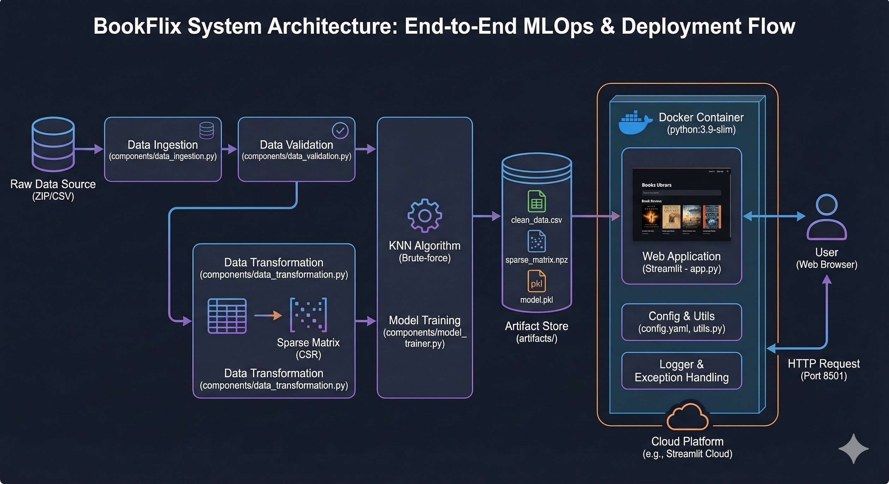

# BookFlix: End-to-End Book Recommendation System


## Executive Summary

This project is a fully operational, production-ready Machine Learning pipeline engineered to deliver highly relevant book recommendations through Collaborative Filtering. Moving beyond experimental Jupyter Notebooks, the system is architected using stringent MLOps principles, encompassing automated data ingestion, validation, high-dimensional matrix transformation, and model serialization.

The recommendation engine is powered by a K-Nearest Neighbors (KNN) algorithm optimized for sparse matrices. The resulting inference system is deployed via a containerized, custom-styled web application featuring a premium, dark-mode user interface tailored for seamless user experience.

**Live Application:** [Access BookFlix Here](https://zaenal-abidin-end-to-end-book-recommendation-system.streamlit.app/)

---

## User Interface & Experience

The presentation layer bypasses the native styling limitations of the Streamlit framework. Through Custom CSS injection, the application achieves a glassmorphism and dark-mode aesthetic, minimizing cognitive load while emphasizing the generated recommendation artifacts (book cover images).


*(Note: The interface incorporates state management to efficiently handle model initialization and artifact caching during runtime.)*

---

## Architectural Blueprint (MLOps Flow)

The system relies on a decoupled, modular architecture ensuring that every phase of the machine learning lifecycle is independently testable, maintainable, and scalable.


*(Placeholder: Insert your high-level system architecture or data flow diagram here)*

### Module Breakdown

#### 1. Data Ingestion (`components/data_ingestion.py`)
* **Operation:** Automated acquisition of the raw dataset.
* **Mechanism:** Securely extracts compressed data archives (`book_data.zip`) into the `artifacts/dataset/raw_data` directory, establishing an immutable foundation for the pipeline.

#### 2. Data Validation (`components/data_validation.py`)
* **Operation:** Schema enforcement and statistical noise reduction.
* **Mechanism:** Isolates statistically significant records by establishing hard thresholds (e.g., users with >200 interactions and books with >=50 ratings). This strict filtering mechanism drastically mitigates the cold-start problem and enhances algorithmic precision.

#### 3. Data Transformation (`components/data_transformation.py`)
* **Operation:** Dimensionality restructuring.
* **Mechanism:** Converts tabular interaction data into a high-dimensional Pivot Table (Users vs. Books). To optimize RAM allocation during the training lifecycle, the dense matrix is compressed into a `scipy.sparse.csr_matrix` format.

#### 4. Model Trainer (`components/model_trainer.py`)
* **Operation:** Algorithm initialization and serialization.
* **Mechanism:** Deploys `sklearn.neighbors.NearestNeighbors` utilizing a brute-force search metric. The trained model learns spatial vector distances and is serialized (`.pkl`) into the `artifacts/trained_model/` directory alongside the dataset indices for low-latency inference.

---

## Technical Infrastructure & Engineering Standards

* **Custom Exception Handling & Logging:** The system implements a robust internal tracking mechanism (`logger/` and `exception/` modules) to capture granular runtime logs and tracebacks, ensuring high observability during pipeline execution.
* **Configuration Management:** All operational parameters, file paths, and model hyperparameters are abstracted into a centralized `config.yaml` and processed via the `entity` and `config` modules, adhering to the DRY (Don't Repeat Yourself) principle.
* **Containerization Strategy (Docker):** The application is packaged using `python:3.9-slim`. The `Dockerfile` is engineered with a strict layer-caching strategy (copying `requirements.txt` and `setup.py` prior to the source code) to minimize build times during continuous integration.

---

## Repository Structure

```text
├── .streamlit/                 # UI configuration overrides
├── artifacts/                  # Generated pipeline outputs
│   ├── dataset/                # Raw, ingested, and transformed data
│   ├── serialized_object/      # Pickled preprocessors/matrices
│   └── trained_model/          # Pickled KNN model
│
├── books_recommender/          # Core Machine Learning Package
│   ├── components/             # Executable ML pipeline stages
│   ├── config/                 # Configuration parsers
│   ├── constant/               # Immutable application constants
│   ├── entity/                 # Data classes and I/O typing
│   ├── exception/              # Custom exception overrides
│   ├── logger/                 # Centralized logging configurations
│   ├── pipeline/               # End-to-end execution triggers
│   └── utils/                  # Shared helper functions
│
├── config/
│   └── config.yaml             # Master configuration file
├── logs/                       # Application runtime logs
├── notebooks/                  # Experimental research environment
│
├── app.py                      # Presentation Layer (Web Application)
├── main.py                     # Pipeline execution entry point
├── Dockerfile                  # Container build instructions
├── requirements.txt            # Python environment dependencies
├── setup.py                    # Package initialization
└── template.py                 # Automated directory scaffolding script

```

---

## Local Deployment Instructions

The application is fully containerized. Ensure Docker Desktop is active on your host machine before proceeding.

**1. Clone the Repository**

```bash
git clone https://github.com/Zendin110206/End-to-End-Book-Recommendation-System.git
cd End-to-End-Book-Recommendation-System
```

**2. Build the Docker Image**

```bash
docker build -t bookflix-app .

```

**3. Initialize the Container**

```bash
docker run -p 8501:8501 bookflix-app

```

*The web interface will be accessible directly via `http://localhost:8501*`

---

*Architected and developed by [Muhammad Zaenal Abidin Abdurrahman](https://www.linkedin.com/in/zendin1102/) - 2026*